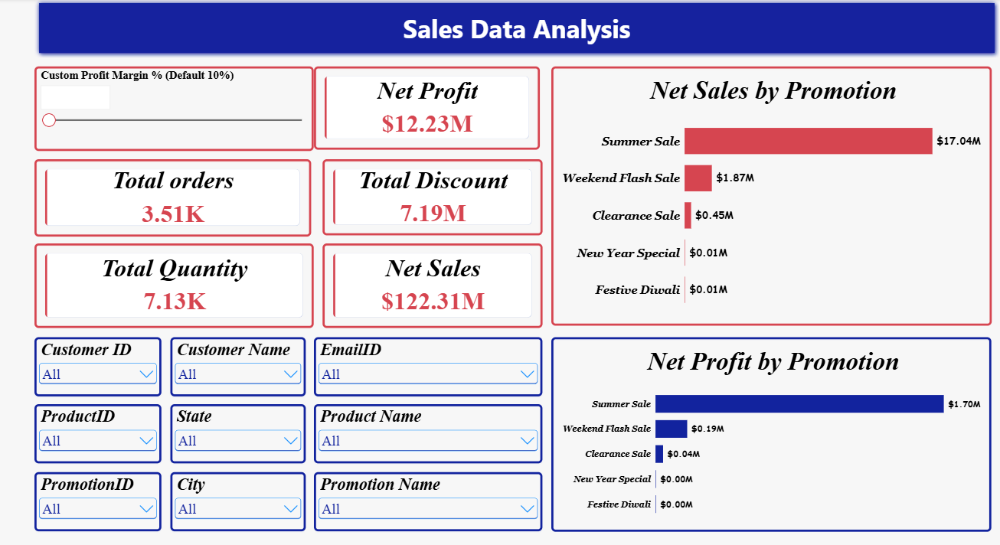

# 📊 Enterprise Sales Performance & Margin Optimization Analysis

[](https://powerbi.microsoft.com/)
[](https://learn.microsoft.com/en-us/dax/)
[](https://www.microsoft.com/excel)
[](LICENSE)

An end-to-end Business Intelligence project developed in **Microsoft Power BI** and **Power Query** using multi-year retail transactions from `datasets/store.xlsx`. The project delivers actionable visibility into top-line revenue drivers, promotional campaign ROI, product profitability tiers, and temporal demand seasonality.

---

## 📌 Executive Summary

Across the retail transaction dataset, the business established the following performance baselines:
* **Gross Revenue:** $128.85 Million
* **Net Sales:** $122.31 Million
* **Net Profit:** $12.23 Million *(evaluated at a default 10% baseline target margin)*
* **Total Discounts Disbursed:** $7.19 Million
* **Throughput:** 3,510 Orders across 7,130 Units Sold *(~2.03 items/order average basket size)*

Beyond standard static reporting, this solution integrates **dynamic financial DAX parameters (What-If margin simulation)** and **disconnected dual-timeline filtering** to solve core retail margin dilution challenges.

---

## 📂 Repository Structure

```text
├── assets/
│   ├── Overview.png
│   ├── Sales trend over time and city.png
│   ├── Top and Bottom 5 Products.png
│   └── Comparison between two periods.png
├── datasets/
│   └── store.xlsx
├── pbix/
│   └── Sales_data_analysis.pbix
├── report/
│   └── Sales_Data_Analysis_Report.docx
└── README.md
```

---

## 🖥️ Dashboard Previews & Visual Architecture

### 1. Executive Overview & Dynamic Margin Simulation
Interactive KPI summary tracking Net Sales, Discounts, Orders, and real-time DAX margin adjustments.
<p align="center">
  
</p>

### 2. Demand Seasonality & Promotional Diagnostics
Monthly revenue trends paired with promotional discount leakage and city-level sales tracking.
<p align="center">
  
</p>

### 3. Product Profitability & Unit Velocity (Pareto Analysis)
Top 5 vs Bottom 5 performers highlighting premium consumer electronics vs FMCG margin drag.
<p align="center">
  
</p>

### 4. Dual-Timeline Comparative Benchmarking
Independent date filter architecture configured via Edit Interactions for side-by-side period audits.
<p align="center">
  
</p>

---

## 🛠️ Data Architecture & Modeling

Data profiling, cleaning, and schema transformations were executed within **Power Query Editor**. The reporting schema is structured around an optimized **Star Schema**:

* **Fact Table:** `Fact_Sales` (Order ID, Product ID, Customer ID, Promotion ID, Transaction Date, Gross Sales, Discount, Quantity)
* **Dimension Tables:**
  * `Dim_Customers` (Customer ID, Customer Name, Email, Region)
  * `Dim_Product` (Product ID, Product Name, Category)
  * `Dim_Promotion` (Promotion ID, Promotion Name, Discount Depth)
  * `Dim_Calendar` (Independent Date tables supporting dual comparative slicers)
* **Cardinality & Filtering:** Strict `1:*` (One-to-Many) relationships with single-direction cross-filtering to preserve referential integrity and query speed.

---

## 💡 Key Business Insights

### 1. Promotional ROI Inefficiency (Summer Sale vs. Flash Sale)
* **Summer Sale:** Primary growth engine—generated **$17.04M in Net Sales** and **$1.70M in Net Profit** with a controlled average discount of **$7.42K**.
* **Weekend Flash Sale:** Heavy margin leak—offered an aggressive **$22.57K average discount (3x higher)** yet generated only **$1.87M Net Sales** and **$0.19M Net Profit**, signaling steep promotional margin dilution without volume return.

### 2. Premium Electronics Drive Volume and Bottom Line
* Challenging standard retail paradigms where cheap everyday goods drive volume, **Apple iPhone 14** was both the **#1 volume driver (281 units)** and **#1 profit contributor ($2.14M)**.
* Followed closely in profit contribution by **Apple MacBook Air ($1.96M)** and **Sony Bravia 55" TV ($1.94M)**.

### 3. FMCG Inventory Drag
* Fast-moving consumer goods like **Colgate Toothpaste ($2.11K profit)**, **Dove Soap Pack ($8.10K)**, and **Nivea Body Lotion ($8.27K profit, 219 units)** generated high warehousing friction with negligible bottom-line contribution.

### 4. Temporal Seasonality & Q4 Surges
* Sales trends peak during pre-holiday and Q4 restocking waves in **October ($12.3M)** and **November ($12.1M)** ($24.4M combined sales), contrasted by troughs in **April ($8.4M)** and **December ($8.4M)**.

---

## 📈 Strategic Business Recommendations

* **Cap Flash Sale Discounts:** Reduce Weekend Flash Sale average discounts from $22.57K down to $10K–$12K and implement minimum basket threshold rules to eliminate margin dilution.
* **Scale Summer Campaign Budgets:** Reallocate marketing budget toward the Summer Sale model, which demonstrates customer price inelasticity and high profit conversion.
* **Bundle Slow-Moving Stock:** Pair slow-moving bottom goods (e.g., Borosil Glass sets, Tupperware) as gift-with-purchase attachments to high-profit electronics (iPhone 14, MacBook Air) to liquidate stagnant warehouse stock.
* **Q4 Supply-Chain Preparation:** Ramp up inventory procurement by August/September to avoid stockouts during the peak October–November revenue wave.

---

## 💻 Technical DAX Formulations

* **Dynamic Profit Forecast (What-If Parameter):**
```dax
Simulated Net Profit = 
[Net Sales] * ('Custom Profit Margin %'[Margin Value])
```

* **Accurate Order Count:**
```dax
Total Orders = 
DISTINCTCOUNT(Fact_Sales[OrderID])
```

* **Net Realized Sales:**
```dax
Net Sales = 
SUM(Fact_Sales[Gross_Sales]) - SUM(Fact_Sales[Discount_Amount])
```

---

## 🚀 How to Run Locally

1. Clone the repository:
```bash
git clone [https://github.com/bansal-deepu/Sales_Data_Analysis.git](https://github.com/bansal-deepu/Sales_Data_Analysis.git)
```
2. Open the Power BI report directly from the `pbix` directory:
```text
pbix/Sales_data_analysis.pbix
```
3. Raw data is located in `datasets/store.xlsx` and the detailed business evaluation document is available in `report/Sales_Data_Analysis_Report.docx`.
4. Interact with the **Custom Profit Margin %** parameter on Page 1 to simulate bottom-line financial scenarios dynamically.

---

---

## 👤 Author

**Deepanshu Bansal**
* 📍 Gharaunda, Haryana, India
* ✉️ [Email](mailto:deepanshubansal.work@gmail.com)
* 🔗 [LinkedIn](https://www.linkedin.com/in/deepanshu-bansal-55db36)
* 🐙 [GitHub Profile](https://github.com/bansal-deepu)
